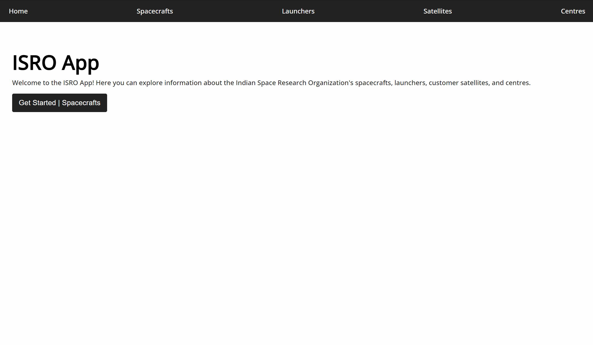
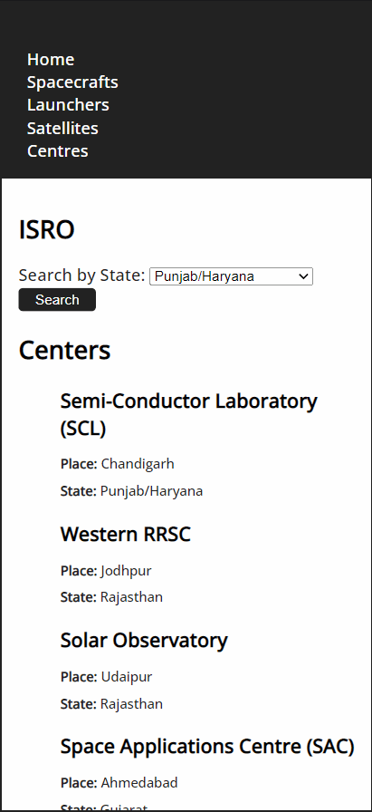

# ISRO

This is a simple project that displays information about Indian Space Research Organization (ISRO) using HTML, CSS, and JavaScript.

The project consists of four pages: home, spacecrafts, launchers, and centers. Each page fetches data from a specific ISRO API and displays the relevant information to the user.

The pages have been styled using CSS to create a consistent and visually pleasing look and feel. The design is responsive, adapting to different screen sizes using media queries.

### Checkout the live website [here](https://isro-api-data.vercel.app/).

## How the website looks like

